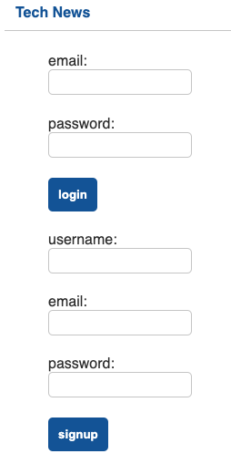
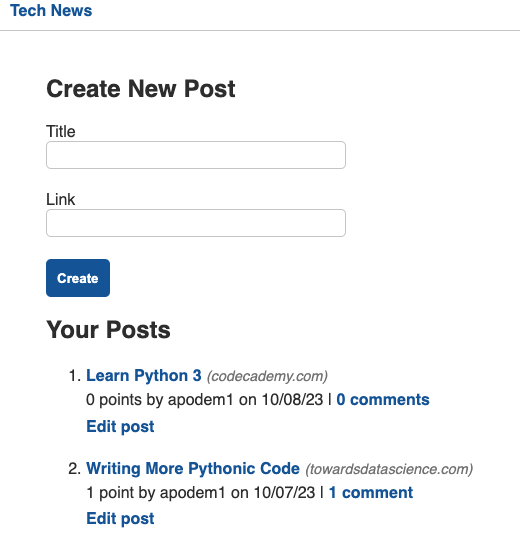

# Tech News Update

## Table of Contents
- [Description](#description) 
- [Usage](#usage)
- [Screenshots](#screenshots)
- [Links](#links)

## Description

Tech News Update is a full stack application that allows users to view, create, and comment on the latest tech news. Users can also delete their own posts and comments. It helps sharing the latest tech news and updates with other users. This app was built with 
    - Python, 
    - Flask, 
    - JavaScript, and 
    - SQLAlchemy.

## Usage

To use this app, go to the deployed link below. You can view the latest tech news without logging in. To create a post or comment, you will need to sign up. Once you sign up, you will be able to create a post, comment on other posts, vote posts, and delete your own posts and comments. 

## Screenshots

## Links

[GitHub Repo](https://github.com/demiapollo/techNews)
[Deployed Link]()

